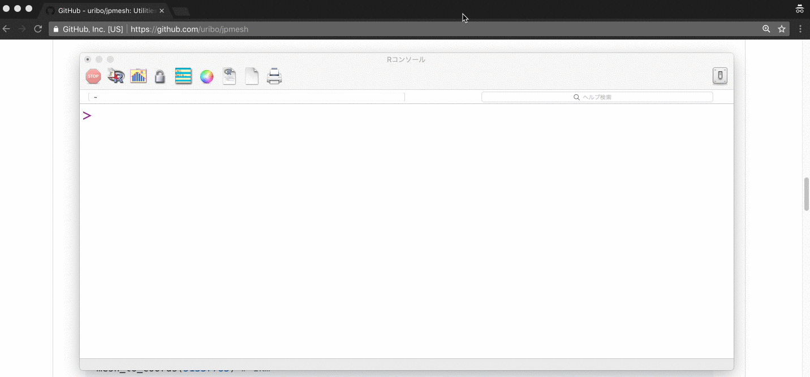
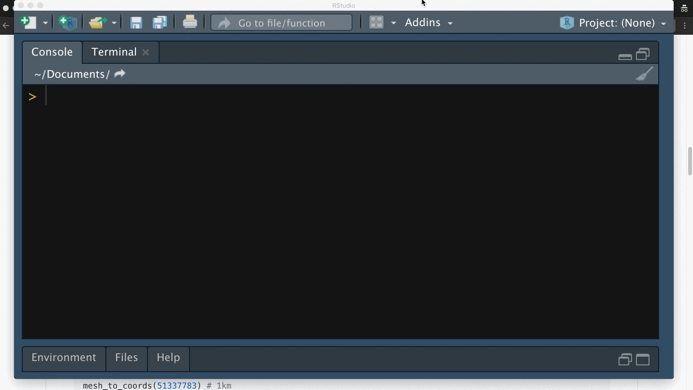
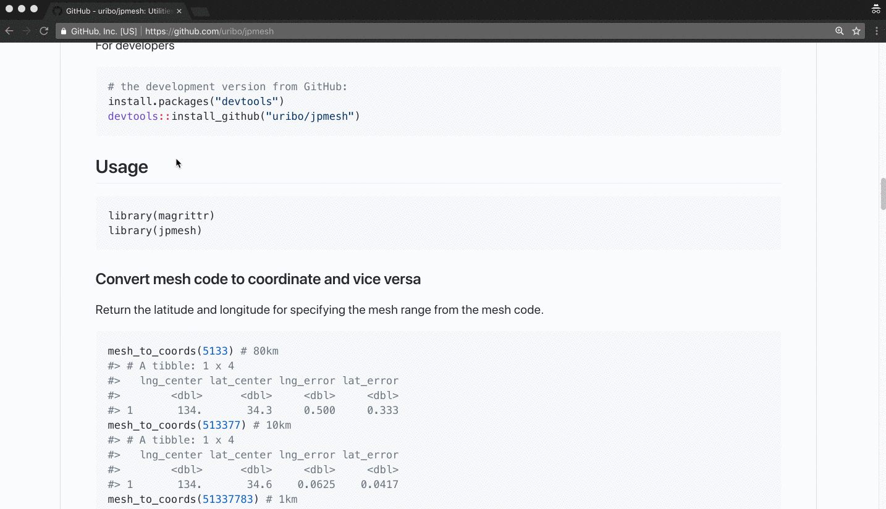

PopClip extentions for R and RStudio
===================================

> This is a collection of [PopClip](http://pilotmoon.com/popclip/) extension(s) for rstas.

 Author: Shinya Uryu ([\@uribo](https://github.com/uribo))

welcome your contribution :)

### Usage 👍

1. Make sure you've installed [PopClip](http://pilotmoon.com/popclip/)
2. Clone or download this repository
3. Download the `.popclipext` files and double click that if you want to use.

### Features 🌟

- 🏃‍ Quickly execute R scripts.
- 🙅‍📎🙅‍ no more COPY & PASTE while changing windows.

### Show case 💎

#### Execute in R Console

----

#### Execute in RStudio Console

---

#### Search on CRAN

---

#### [WIP] Open Source Code at GitHub
